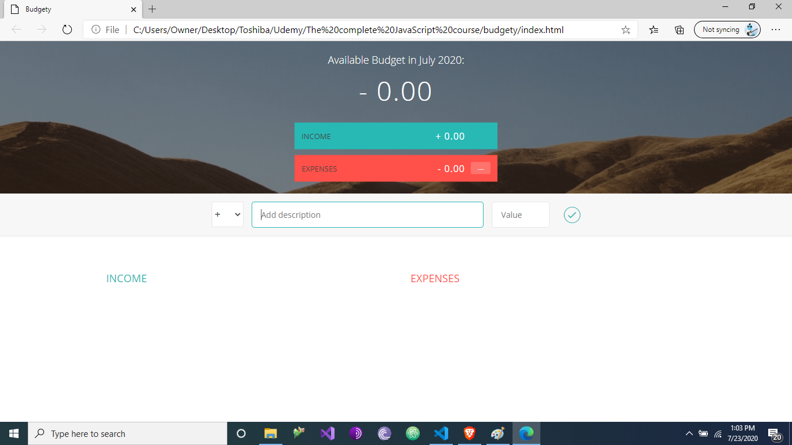

# Budgety
Project build with Inmediately Invoke Function Expressions (IIFE) and Closures in vanilla JavaScript following the guide in the Udemy course "The Complete JavaScript Course 2020: Build Real Projects!" created by Jonas Schmedtmann.

This project



## Built With
- HTML
- CSS
- Javascript. 


## Authors
### Author1
- 👤GitHub: [Jose Abel Ramirez](https://github.com/jose-Abel)

## Getting Started
You can clone this code anytime and load the HTML on your browser. Since it was build with vanilla JavaScript it doesn't need any other package.


## Live version
https://relaxed-lumiere-34cf37.netlify.app/


### Setup
You can either copy the code with git clone or just do a git pull on your local environment. Just install the live-version npm package globablly with

```
    npm i -g live-server
```

Then run in the root of the directory from the terminal

```
    live-server
```

### Acknowledgments
Appreciate the teams at Udemy and the creator of the course Jonas Schmedtmann since allows me to learn a lot of JavaScript concepts and design principles that is pushing my software development career higher.


## 📝 License
This project is MIT licensed.


## Show your support
Give a ⭐️ if you like this project!